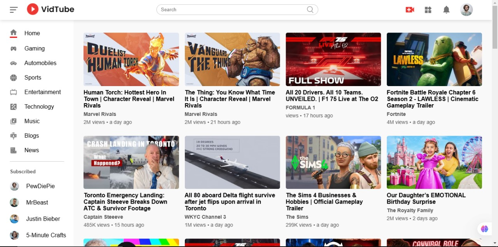

# 🎥 YouTube Clone

A simple and responsive **YouTube Clone** built with React, utilizing the YouTube Data API to fetch and display trending videos. 🚀

## 🛠️ Features

- 📺 Watch trending YouTube videos
- 🔍 Search for videos by category
- 🎭 View video details and comments
- 🏠 Sidebar for easy navigation
- 🏆 Recommended videos section

## 📦 Technologies Used

- ⚛️ React.js
- 🎨 CSS (for styling)
- 🌍 React Router (for navigation)
- 🔑 YouTube Data API
- ⏳ Moment.js (for formatting timestamps)

## 🚀 Getting Started

1. Clone the repository:
   ```bash
   git clone https://github.com/your-repo/youtube-clone.git
   ```
2. Navigate to the project folder:
   ```bash
   cd youtube-clone
   ```
3. Install dependencies:
   ```bash
   npm install
   ```
4. Add your **YouTube API Key** in `data.js` 📌
5. Start the development server:
   ```bash
   npm start
   ```

## 📸 Screenshots




## 🤝 Contributing

Contributions are **welcome**! Feel free to **fork** this repo, create a **pull request**, and improve the project. 🎉


